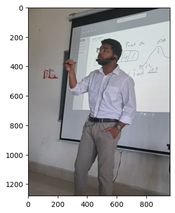
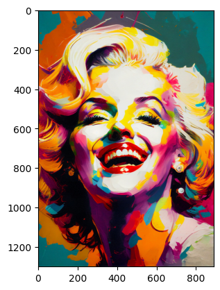
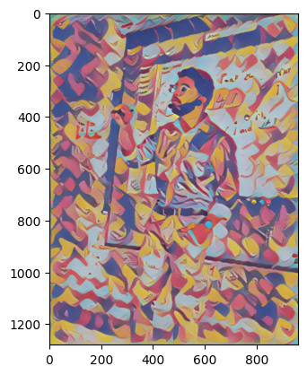

# 🎨 Neural Style Transfer

Welcome to the **Neural Style Transfer** project! This tool allows you to merge the content of one image and the artistic style of another to create stunning mixed images. 🖼️✨

## 📝 Table of Contents

- [🌟 Overview](#-overview)
- [⚙️ Installation](#-installation)
- [🚀 Usage](#-usage)
- [🔍 Code Explanation](#-code-explanation)
- [📷 Example](#-example)
- [🎉 Results](#-results)
- [🤝 Contributing](#-contributing)
- [📄 License](#-license)

## 🌟 Overview

Neural Style Transfer (NST) combines two images:
- **Content Image** 🖼️: The image with the main structure and objects.
- **Style Image** 🎨: The image from which artistic textures and patterns are borrowed.

This project uses a TensorFlow Hub model to achieve the mixing, creating an image with the **content** of one and the **style** of the other. 🧑‍🎨

## ⚙️ Installation

1. Clone the repository:  
   ```bash
   git clone https://github.com/srivardhan-kondu/Neural-Style-Transfer.git
   cd Neural-Style-Transfer
   ```

2. Install the required dependencies:  
   ```bash
   pip install tensorflow tensorflow_hub matplotlib numpy opencv-python
   ```

3. Make sure you have your **content** and **style** images in the project directory.

## 🚀 Usage

To generate a stylized image, follow these steps:

1. Place your **content image** and **style image** in the project directory.
2. Run the following command:  
   ```bash
   python neural_style_transfer.py
   ```

3. The generated image will be saved as `generated_img.jpg` in the directory.

### 🖼️ Input Images
- **Content Image**: `input.jpg`
- **Style Image**: `style.jpg`

### 🖼️ Output Image
- The generated image will be saved as `generated_img.jpg`.

## 🔍 Code Explanation

### Key Sections of the Code:

1. **Importing Libraries** 📚:
    ```python
    import tensorflow_hub as hub
    import tensorflow as tf
    from matplotlib import pyplot as plt
    import numpy as np
    import cv2
    ```

2. **Loading the Pre-Trained Model** 🚀:
    The model for stylization is loaded from TensorFlow Hub:
    ```python
    model = hub.load('https://tfhub.dev/google/magenta/arbitrary-image-stylization-v1-256/2')
    ```

3. **Image Preprocessing** 🖼️:
    This helper function loads and preprocesses images for the model:
    ```python
    def load_image(img_path):
        img = tf.io.read_file(img_path)
        img = tf.image.decode_image(img, channels=3)
        img = tf.image.convert_image_dtype(img, tf.float32)
        img = img[tf.newaxis, :]
        return img
    ```

4. **Performing Style Transfer** 🎨:
    The model applies the style of the style image to the content image:
    ```python
    stylized_image = model(tf.constant(content_image), tf.constant(style_image))[0]
    ```

5. **Saving the Generated Image** 💾:
    Finally, the generated image is saved using OpenCV:
    ```python
    cv2.imwrite('generated_img.jpg', cv2.cvtColor(np.squeeze(stylized_image)*255, cv2.COLOR_BGR2RGB))
    ```

## 📷 Example

### 🎨 Content Image:


### 🖌️ Style Image:


### 🧑‍🎨 Generated Image:


---

## 🎉 Results

After running the code, you will get:

1. The **style image** and **content image** displayed.
2. The **generated image** with content and style merged.
3. The output saved as `generated_img.jpg`.

### 📥 Download the Generated Image
Once processed, you can [download the generated image](generated_img.jpg). 🎨

## 🤝 Contributing

We welcome contributions! If you have improvements or bug fixes, feel free to open a pull request or issue.

1. Fork this repository.
2. Create a new branch with your changes.
3. Submit a pull request for review.

## 📄 License

This project is licensed under the MIT License. See the `LICENSE` file for more details.

---

📩 **Contact**: Reach out via [srivardhan.kondu@gmail.com](mailto:srivardhan.kondu@gmail.com) if you have any questions or suggestions.
